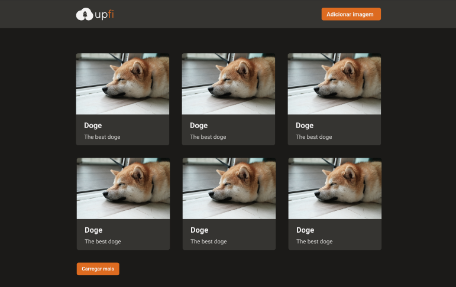

<h1 align="center">
  Challenge 07 - Images Upload
</h1>

  

 

  

 

## 💻 About the challenge

In this challenge, my main objective was to add a few features to the application to make it work properly. The application makes requests to my Next API which will return data from FaunaDB and ImgBB. I also had to follow a layout from Figma.
I practiced here some contents:
- Infinite Queries and Mutations with React Query
- Form submission and validation with React Hook Form
- Modal and Toast display with Chakra UI

 

## 🖱 Technologies

- ReactJS
- NextJS
- TypeScript
- Chakra UI
- Axios
- React Query
- React Hook Form
- Fauna DB
- ImgBB
- Axios
- Figma